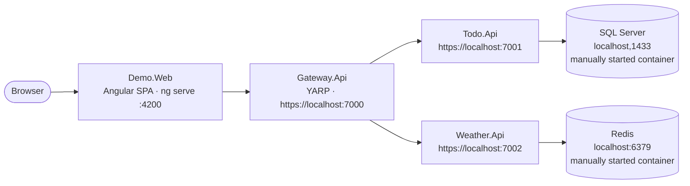

# .NET Aspire Demo

A demo application for a meetup talk about **.NET Aspire**. It's deliberately
**over-engineered in architecture** (a gateway, two APIs, SQL Server, Redis, and an Angular SPA) but
**trivial in function** (a todo list and a fake weather forecast). The heavy topology exists to create
real "distributed app" pain that Aspire then relieves.

The talk is a **before/after performed live by walking Git tags** — see [Demo flow](#demo-flow).

## Architecture



| Project                    | Role                                                               |
|----------------------------|--------------------------------------------------------------------|
| `src/Todo.Api`             | Minimal API, CRUD todos, EF Core → SQL Server                      |
| `src/Weather.Api`          | Minimal API, fake forecast with Redis cache-aside                  |
| `src/Gateway.Api`          | YARP reverse proxy — the single ingress the browser talks to       |
| `src/Demo.Web`             | Angular SPA (Todos + Weather pages)                                |
| `src/Demo.ServiceDefaults` | Shared OpenTelemetry, health checks, service discovery, resilience |
| `src/Demo.AppHost`         | Aspire orchestrator — the "one F5"                                 |

**Endpoints (via the gateway):** `GET/POST/PUT/DELETE /api/todos` · `GET /api/weather/{city}`

## Prerequisites

- [.NET 10 SDK](https://dotnet.microsoft.com/download)
- The **.NET Aspire** tooling (Aspire SDK `13.3.5`, referenced by `Demo.AppHost`)
- **Node.js + npm** (for the Angular SPA)
- A container runtime — **Podman Desktop** (or Docker) — Aspire starts SQL Server and Redis as containers

## Run it (with Aspire)

```bash
cd src/Demo.Web && npm install && cd ../..      # one-time: restore SPA packages
dotnet run --project src/Demo.AppHost           # or press F5 on Demo.AppHost in your IDE
```

One command starts the SQL Server and Redis containers, runs the API migrations, launches all three
APIs, and serves the Angular SPA — then opens the **Aspire dashboard** (resources, logs, distributed
traces, metrics). Open the SPA from the dashboard's `web` endpoint.

> First run is slow: the SQL Server container image is large to pull and slow to start. Aspire's
> `WaitFor` handles the ordering for you.

## Demo flow

The before/after is driven by Git tags. Start on `aspire-0-no-aspire` (everything wired the manual
way, no Aspire) and `git diff` / `git checkout` forward one tag at a time:

| Tag                      | Adds                                                                  | Aspire capability shown                |
|--------------------------|-----------------------------------------------------------------------|----------------------------------------|
| `aspire-0-no-aspire`     | The four projects wired manually (hardcoded ports/connection strings) | — (the pain)                           |
| `aspire-1-weather`       | `ServiceDefaults` + `AppHost`; Weather + Redis under Aspire           | Orchestration, integrations, telemetry |
| `aspire-2-gateway`       | Gateway joins; YARP destination → `http://weather-api`                | Service discovery                      |
| `aspire-3-gateway-local` | Standalone-fallback config for the gateway                            | Discovery is just config (no lock-in)  |
| `aspire-4-todo`          | Todo + SQL Server container + migrate-on-start                        | SQL integration, `WaitFor` ordering    |
| `aspire-5-frontend`      | Angular SPA orchestrated (`PORT` + `GATEWAY_URL` injected)            | One F5 for the whole system            |

```bash
git checkout aspire-0-no-aspire        # the "before"
git diff aspire-0-no-aspire aspire-1-weather   # what adding Aspire to Weather changed
```

`HEAD` (`main` = `aspire-5-frontend`) is the finished, fully-orchestrated state.

## Running services standalone (without Aspire)

Every service also runs on its own — Aspire-injected values override at runtime, but each project
falls back to local config (`appsettings.Development.json`, `proxy.conf.js`, `aspire-serve.js`) when
run directly. For example:

```bash
dotnet run --project src/Todo.Api          # uses the local SQL Server in appsettings.Development.json
cd src/Demo.Web && npm start               # ng serve on port 4200, proxies /api to https://localhost:7000
```

## Notes

- The browser talks **only** to the gateway, and the Angular dev-server proxy makes the SPA
  same-origin — so there is **no CORS configuration** anywhere.
- The Weather service uses an artificial ~2s delay on a cache miss and a short 15s Redis TTL **on
  purpose**, so cache hits/misses/expiry are visible live.
- Solution file is `Demo.slnx`.
